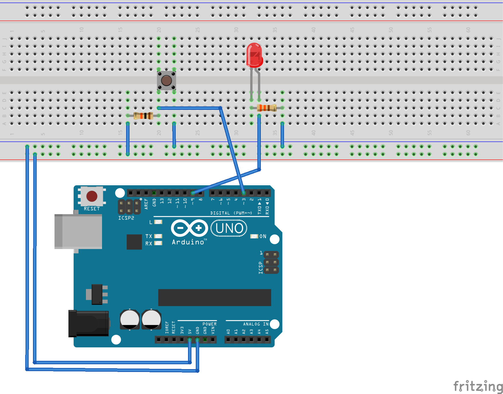

# Arduino on Python

ArduinoとPythonを使ってLチカできるようにします。Pythonのプログラムを変更することでLEDが光ったり、消えたりすることや、ボタンを押した100回のうち1回の確率でLEDが光ったりしたり…

## 回路図

### 必要なもの

+ Arduino Uno
+ ブレッドボード
+ タクトスイッチ
+ 10k Ohm resister
+ LED
    + 330 Ohm resister
+ ジャンパワイヤ

## Instllation

PythonとArduinoとでシリアル通信をするためのライブラリ、pySerialをインストールします。

    $ pip install pyserial

## Execute

    $ python reporter.py

## 仕組み追加方法

1. filename.pyを作成
2. class Filenameを作成
3. pushメソッドを作成。return Trueで点灯、return Falseで消灯
4. reporter.pyに作成したfilenameをimport
5. reporter.pyの変数pへインスタンスを作成

reporter.py

    import filename
    p = filename.Filename

